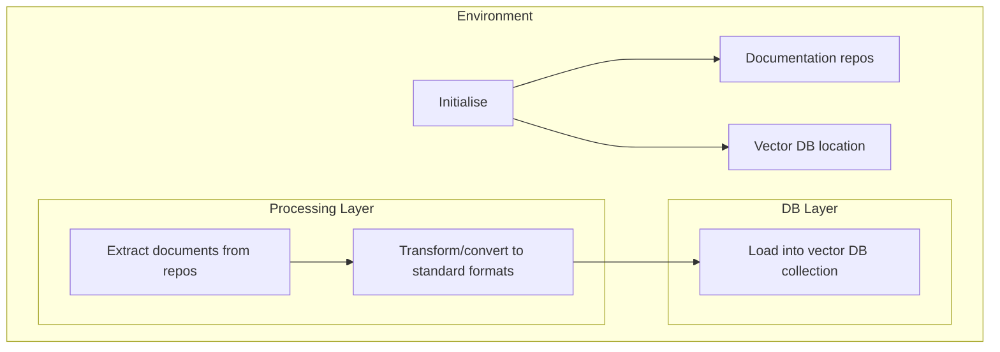

# Vectorisation Process



## Overview

The following are select code snippets from `duckdb-assistant`'s codebase which deal with the vectorisation of documentation. 

The entire process is captured under a `sync_docs` method, referring to synchronisation of documents from a repository to a vector database.  Refer [here](https://github.com/SundareshSankaran/duckdb-assistant/blob/main/src/duckdb_assistant/assistant.py#158) for the full code.

```python
    def sync_docs(self) -> str:
        """This function retrieves data from a specified knowledge source and makes it available in a Chroma collection to help DuckDB Assistant"""
        # ...
        final_collection_path = os.path.join(self.chroma_collection_path,folder_path)
        clone_sparse_checkout(repo_url = repo_url, target_dir =self.chroma_collection_path, folder_path = folder_path, branch="main")
        docs = load_markdown_docs(final_collection_path, "duckdb-docs")
        collection_count = store_in_chroma(docs, collection_name = "duckdb_docs", persist_dir = self.chroma_collection_path)
        return f"{collection_count} documents available in collection duckdb_docs"
```

`sync_docs` further calls the following functions. 

`clone_sparse_checkout` clones a specified document repository (a GitHub repo, but this can be modified to suit other locations) to a staging area.

```python
def clone_sparse_checkout(repo_url: str, target_dir: str, folder_path: str, branch: str = "main"):
    """
    Clone only a specific folder from a GitHub repo using sparse checkout.
    """
# ..
    
    target_dir = os.path.abspath(target_dir)

    if os.path.exists(target_dir):
        shutil.rmtree(target_dir)

    subprocess.run(
        ["git", "clone", "--no-checkout", "--depth", "1", repo_url, target_dir],
        check=True,
    )
# ..
    try:
        os.chdir(target_dir)
        subprocess.run(["git", "sparse-checkout", "init", "--cone"], check=True)
        subprocess.run(["git", "sparse-checkout", "set", folder_path], check=True)
        subprocess.run(["git", "checkout", branch], check=True)
    finally:
        os.chdir(cwd)

```

`load_markdown_docs` transforms content in documentation to a standard format.

```python
def load_markdown_docs(root_folder: str, repo_name: str) -> List[Dict]:
    """
    Load markdown files and create records with id, title, content, and metadata.
    """
    # ..

    for idx, md_path in enumerate(md_files):
        content = md_path.read_text(encoding="utf-8", errors="ignore")
        rel_path = md_path.as_posix()
        title = extract_title(content, fallback=md_path.stem)

        doc_id = f"{repo_name}:{idx}:{md_path.relative_to(root_folder).as_posix()}"

        docs.append(
            {
                "id": doc_id,
                "title": title,
                "content": content,
                "metadata": {
                    "title": title,
                    "source_path": rel_path,
                    "file_name": md_path.name,
                    "extension": md_path.suffix,
                },
            }
        )
    return docs
```

Finally, `store_to_chroma` loads these documents to a vector database collection.

```python

def store_in_chroma(docs: List[Dict], collection_name: str = "markdown_docs", persist_dir: str = "./chroma_db")->int:
    """
    Store docs in ChromaDB.
    """
# ..
    
    with chromadb.PersistentClient(path=persist_dir) as client:
        collection = client.get_or_create_collection(name=collection_name)
        ids = [doc["id"] for doc in docs]
        documents = [doc["content"] for doc in docs]
        metadatas = [doc["metadata"] for doc in docs]
        collection.upsert(
            ids=ids,
            documents=documents,
            metadatas=metadatas,
        )
        collection_count = collection.count()
    return collection_count

```

The `sync_docs` method is usually called after initialising a `DuckDBAssistant`.  Users may choose to run the assistant without RAG.

```python

dda = DuckDBAssistant()

dda.sync_docs()

```

Retrieval-augmented Generation (RAG) is executed under the covers when the `generate` method is called.

```python

   def generate(self, prompt:str, explain_results: bool = False, use_rag: bool = True, sql_file_path: str = None ) -> dict:
        """This function generates a DuckDB SQL query based on a given prompt using Gemini API. Provide the prompt as an argument."""
  # ..

        if use_rag:
            if self.collection_exists == False:
                rag_context ="No further context"
            else:
                rag_results = self.search(prompt)
                rag_context = "|".join(rag_results["documents"])
            prompt+=f"Context: {rag_context}"
        
        try:
      # ..
                  return query_result
        except Exception as e:
            return {"query": f"Error occurred: {e}"}

```

Or, the `search` method explicitly queries the collection.

```python
res = dda.search("Tell me how to load from a Parquet file", display_results=True)

```