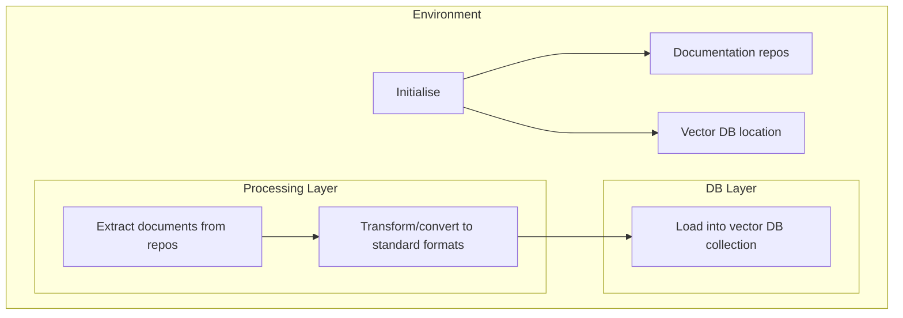

```mermaid
graph TD
subgraph Environment
Initialise[Initialise] --> R1
Initialise[Initialise] --> D1
D1[Vector DB location]
R1[Documentation repos]
subgraph DB Layer
  D2[Load into vector DB collection]
end
subgraph Processing Layer
  P1[Extract documents from repos]
  P2[Transform/convert to standard formats]
end

end

P1 --> P2 --> D2


```
